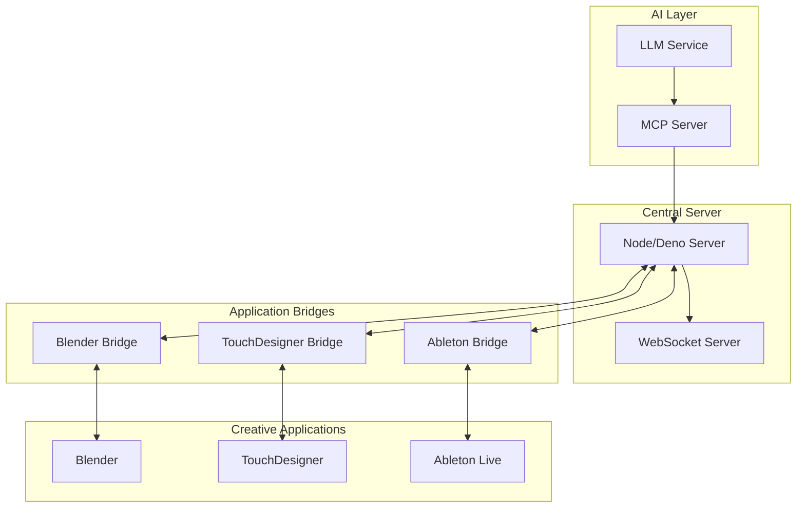

# Lightfast Computer

A centralized IPC (Inter-Process Communication) server for managing connections between creative applications like Blender, TouchDesigner, and Ableton Live, enhanced with AI-powered instruction generation using Model Context Protocol (MCP). Supports seamless multi-application workflows with context-aware synchronization.

## Overview

This project provides a robust communication layer between different creative applications, enabling seamless integration and control. It uses:
- WebSocket for real-time communication
- LLM (Claude/OpenAI) for instruction generation
- MCP for standardized application communication
- Type-safe interfaces for each supported application
- Context-aware state management across applications

## Key Features

- **Multi-Application Workflows**: Seamlessly work across multiple creative applications
- **Context Awareness**: Maintains state and relationships between applications
- **Natural Language Control**: Control multiple applications using natural language
- **Real-time Synchronization**: Keep applications in sync during creative work
- **Intelligent Command Generation**: AI-powered command generation based on context

## Example Workflow

Create a synchronized music-visual experience:
```typescript
// Initialize a multi-application project
const project = await client.createProject({
  applications: ['ableton', 'blender', 'touchdesigner']
});

// Create music in Ableton
await project.sendInstruction("Create a new track in Ableton with a bass line");

// Generate visuals in Blender
await project.sendInstruction("Create a 3D scene in Blender that reacts to the bass");

// Connect visuals to music in TouchDesigner
await project.sendInstruction("Set up TouchDesigner to visualize the audio from Ableton");

// Synchronize all applications
await project.synchronize();
```

## Supported Applications

- Blender (via Python API)
- TouchDesigner (via Python API)
- Ableton Live (via MIDI/OSC)

## Architecture



## Prerequisites

- Node.js 18+ or Deno 1.30+
- Blender 3.0+
- TouchDesigner 2022+
- Ableton Live 11+
- Claude/OpenAI API access

## Installation

```bash
# Clone the repository
git clone https://github.com/yourusername/creative-apps-ipc.git

# Install dependencies
npm install

# Configure LLM and MCP settings
cp config.example.json config.json
# Edit config.json with your API keys and settings

# Build the project
npm run build
```

## Usage

1. Start the central server:
```bash
npm start
```

2. Start the application bridges:
```bash
# In separate terminals
npm run bridge:blender
npm run bridge:td
npm run bridge:ableton
```

3. Connect your applications:
```typescript
import { BlenderClient } from './clients/blender-client';

const client = new BlenderClient();
await client.connect();

// Send natural language instructions
await client.sendInstruction("Create a sphere with radius 2");
```

## Development

### Project Structure

```
src/
├── llm/              # LLM service implementation
├── mcp/              # MCP server and protocol
├── server/           # Central server implementation
├── bridges/          # Application-specific bridges
├── clients/          # TypeScript clients for each app
├── types/            # TypeScript type definitions
└── utils/            # Utility functions
```

### Running Tests

```bash
npm test
```

### Building

```bash
npm run build
```

## Contributing

1. Fork the repository
2. Create your feature branch (`git checkout -b feature/amazing-feature`)
3. Commit your changes (`git commit -m 'Add some amazing feature'`)
4. Push to the branch (`git push origin feature/amazing-feature`)
5. Open a Pull Request

## License

This project is licensed under the MIT License - see the [LICENSE](LICENSE) file for details.
