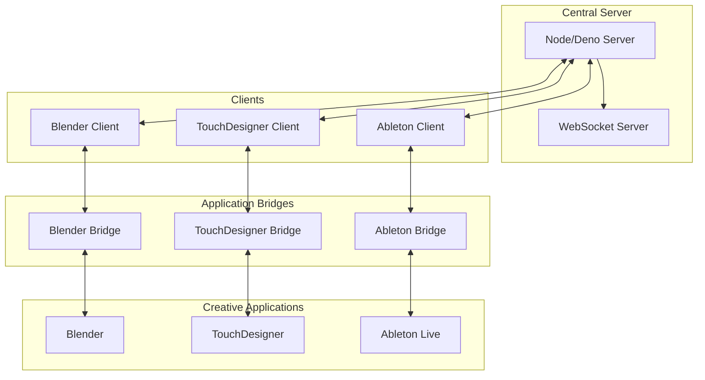

# Lightfast Computer

A centralized IPC (Inter-Process Communication) server for managing connections between creative applications like Blender, TouchDesigner, and Ableton Live.

## Overview

This project provides a robust communication layer between different creative applications, enabling seamless integration and control. It uses WebSocket for real-time communication and provides type-safe interfaces for each supported application.

## Supported Applications

- Blender (via Python API)
- TouchDesigner (via Python API)
- Ableton Live (via MIDI/OSC)

## Architecture



## Prerequisites

- Node.js 18+ or Deno 1.30+
- Blender 3.0+
- TouchDesigner 2022+
- Ableton Live 11+

## Installation

```bash
# Clone the repository
git clone https://github.com/yourusername/creative-apps-ipc.git

# Install dependencies
npm install

# Build the project
npm run build
```

## Usage

1. Start the central server:
```bash
npm start
```

2. Start the application bridges:
```bash
# In separate terminals
npm run bridge:blender
npm run bridge:td
npm run bridge:ableton
```

3. Connect your applications:
```typescript
import { BlenderClient } from './clients/blender-client';

const client = new BlenderClient();
await client.connect();
```

## Development

### Project Structure

```
src/
├── server/           # Central server implementation
├── bridges/          # Application-specific bridges
├── clients/          # TypeScript clients for each app
├── types/            # TypeScript type definitions
└── utils/            # Utility functions
```

### Running Tests

```bash
npm test
```

### Building

```bash
npm run build
```

## Contributing

1. Fork the repository
2. Create your feature branch (`git checkout -b feature/amazing-feature`)
3. Commit your changes (`git commit -m 'Add some amazing feature'`)
4. Push to the branch (`git push origin feature/amazing-feature`)
5. Open a Pull Request

## License

This project is licensed under the MIT License - see the [LICENSE](LICENSE) file for details.
