# Architecture Documentation

## System Overview

The Creative Apps IPC Server is designed as a centralized communication hub for creative applications. It uses internal IPC (Inter-Process Communication) mechanisms to enable real-time, bidirectional communication between applications, enhanced with LLM-powered instruction generation and MCP (Model Context Protocol) integration.

## Component Architecture

### 1. IPC Communication Layer

The IPC layer handles direct process-to-process communication:

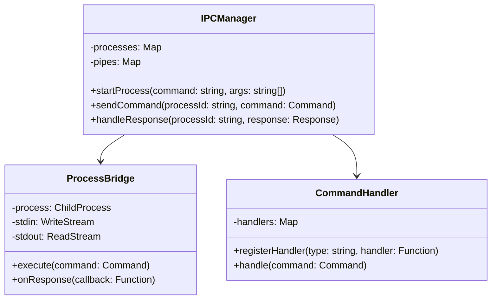

### 2. Process Communication Flow

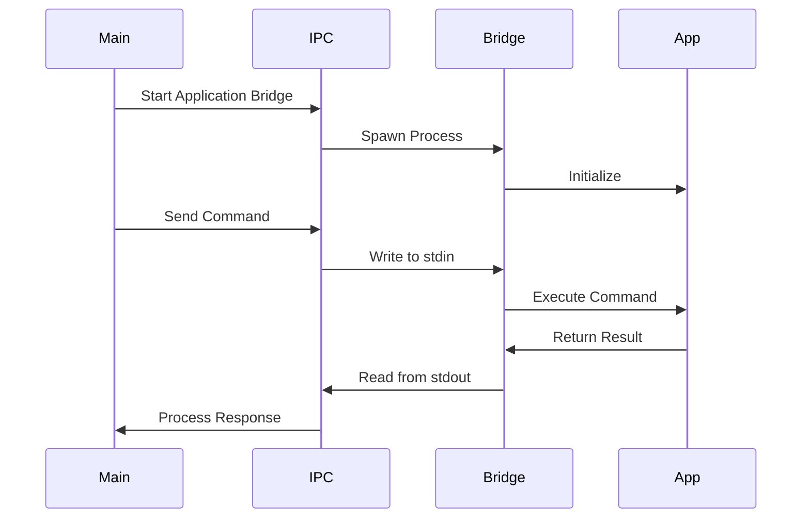

### 3. Implementation Examples

#### Unix-based Systems (Unix Domain Sockets):
```typescript
interface UnixIPC {
  // Create Unix domain socket
  createSocket(path: string): Promise<void>;

  // Send command through socket
  sendCommand(socket: Socket, command: Command): Promise<void>;

  // Handle responses
  handleResponse(socket: Socket): Promise<Response>;
}
```

#### Windows (Named Pipes):
```typescript
interface WindowsIPC {
  // Create named pipe
  createPipe(name: string): Promise<void>;

  // Send command through pipe
  sendCommand(pipe: Pipe, command: Command): Promise<void>;

  // Handle responses
  handleResponse(pipe: Pipe): Promise<Response>;
}
```

#### Cross-Platform Process Communication:
```typescript
interface ProcessIPC {
  // Start application bridge
  startBridge(command: string, args: string[]): Promise<ChildProcess>;

  // Send command to process
  sendCommand(process: ChildProcess, command: Command): Promise<void>;

  // Handle process response
  handleResponse(process: ChildProcess): Promise<Response>;
}
```

### 4. Command Protocol

```typescript
interface IPCCommand {
  type: CommandType;
  payload: unknown;
  metadata: {
    timestamp: number;
    source: string;
    target: string;
    correlationId: string;
  };
}

enum CommandType {
  INIT = 'init',
  EXECUTE = 'execute',
  QUERY = 'query',
  TERMINATE = 'terminate'
}
```

### 1. LLM Service Layer

The LLM service layer handles instruction generation and command validation:

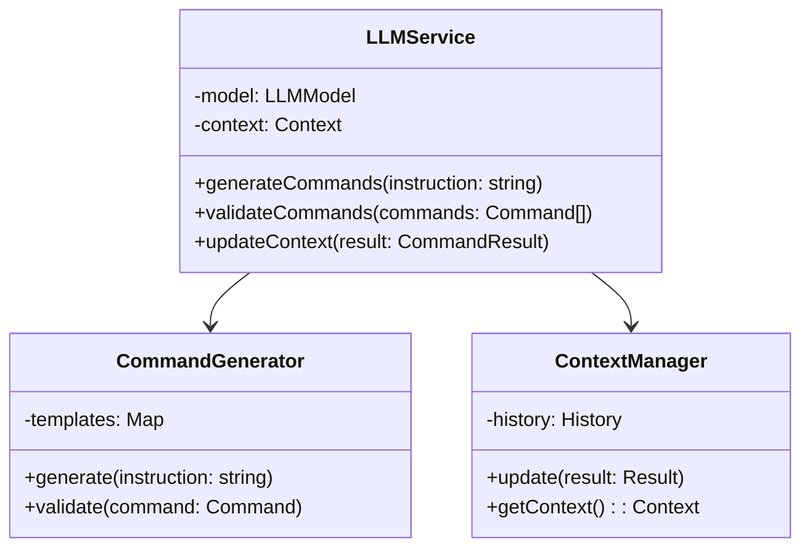

### 2. MCP Integration Layer

The MCP layer manages communication between LLM and applications:

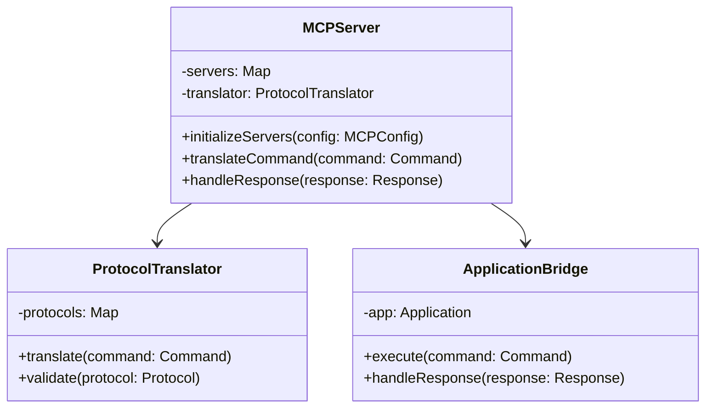

### 3. Central Server

The central server manages all communications:

- HTTP Server for REST API endpoints
- WebSocket Server for real-time communication
- Message Queue for handling asynchronous operations
- Connection Manager for tracking application states

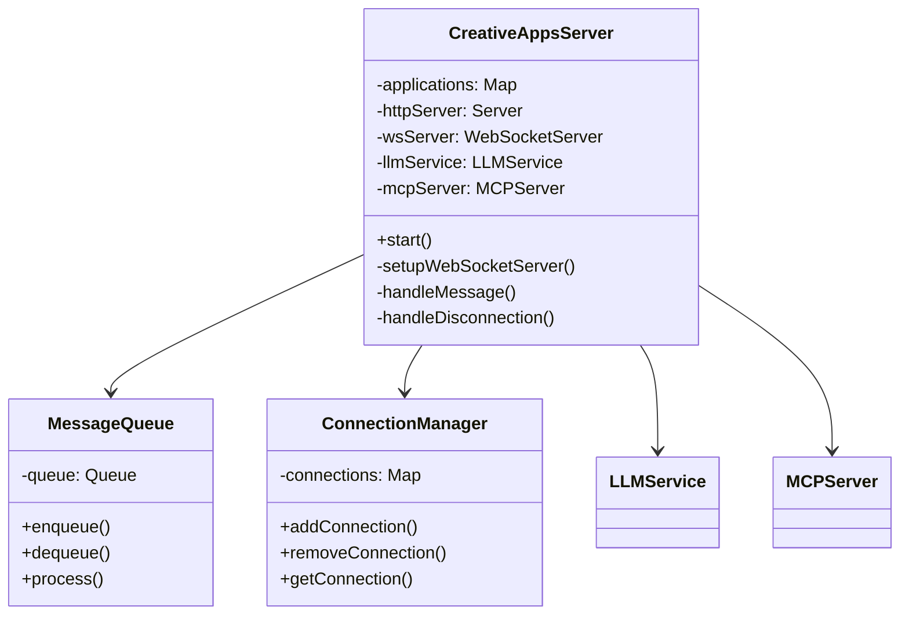

### 4. Application Bridges

Bridges are application-specific components that handle the translation between the central server's protocol and each application's native API.

#### Blender Bridge
- Uses Python API
- Handles scene manipulation
- Manages object creation and modification
- Controls rendering settings

#### TouchDesigner Bridge
- Uses Python API
- Manages node creation and connections
- Controls parameter values
- Handles texture updates

#### Ableton Bridge
- Uses MIDI/OSC protocol
- Controls transport (play, stop, etc.)
- Manages clip launching
- Handles parameter automation

### 5. Clients

TypeScript clients provide type-safe interfaces for interacting with each application:

```typescript
interface BaseClient {
  connect(): Promise<void>;
  disconnect(): Promise<void>;
  send(message: Message): Promise<Response>;
}

interface BlenderClient extends BaseClient {
  executePython(code: string): Promise<void>;
  createObject(type: string, params: ObjectParams): Promise<void>;
  updateScene(data: SceneData): Promise<void>;
}
```

### 1. Context Management Layer

The context management layer handles state and relationships across multiple applications:

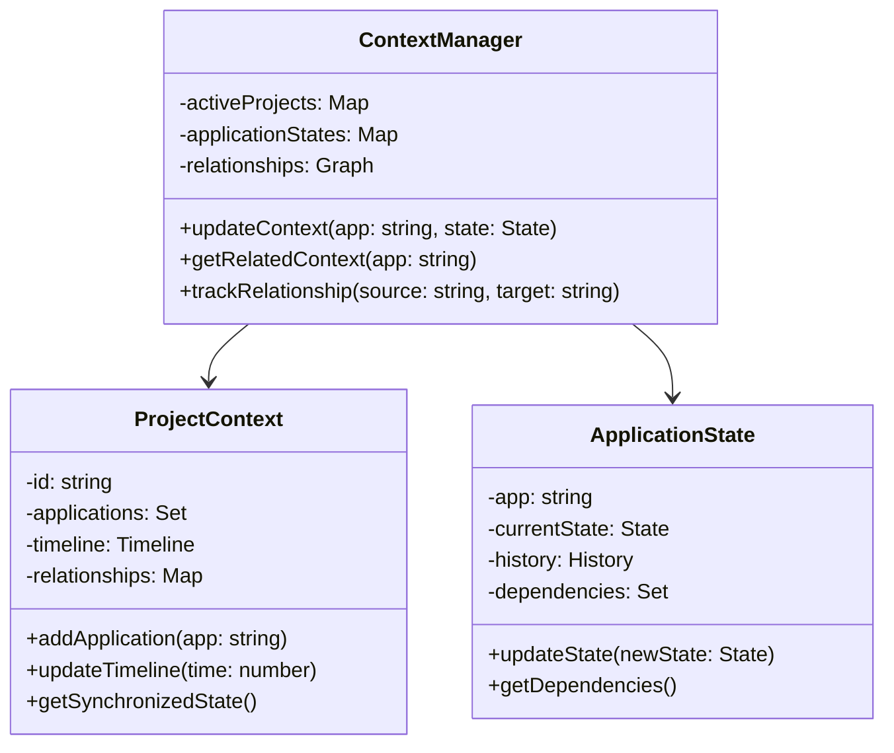

### 2. Cross-Application Synchronization

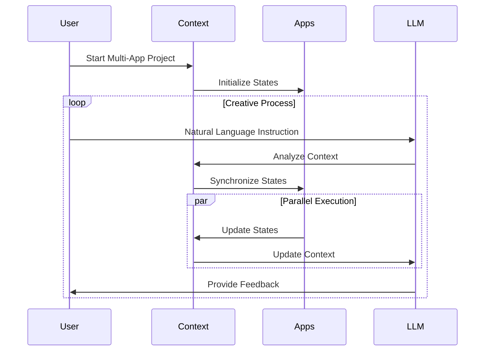

### 3. State Management

The system maintains several types of state:

1. **Project State**
   - Active applications
   - Timeline synchronization
   - Cross-application dependencies
   - Project metadata

2. **Application State**
   - Current operation mode
   - Active elements
   - Parameter values
   - Operation history

3. **Relationship State**
   - Data flow between applications
   - Synchronization points
   - Dependency chains
   - Event triggers

### 4. Context-Aware Instruction Generation

The LLM service uses context to generate appropriate commands:

```typescript
interface ContextAwareLLM {
  // Generate commands considering all active applications
  generateMultiAppCommands(
    instruction: string,
    context: ProjectContext
  ): Promise<Command[]>;

  // Validate commands against current state
  validateMultiAppCommands(
    commands: Command[],
    context: ProjectContext
  ): Promise<ValidationResult>;

  // Update context based on execution results
  updateProjectContext(
    results: CommandResult[],
    context: ProjectContext
  ): Promise<void>;
}
```

### 5. Example Workflow: Music-Visual Creation

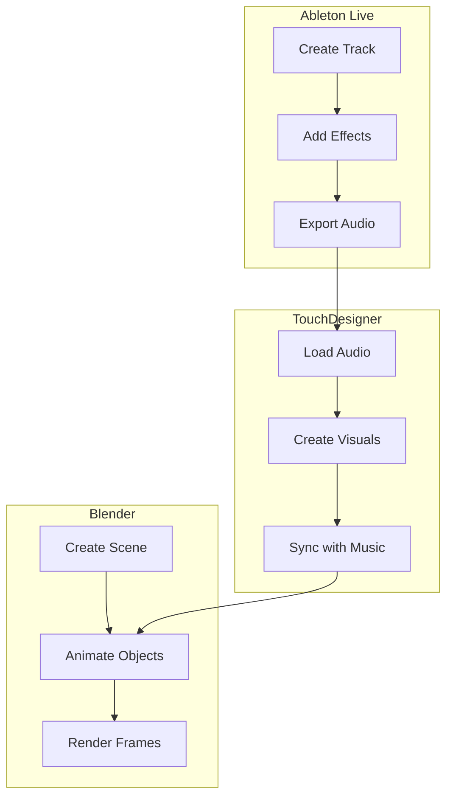

## Alternative Simplified Architecture

For simpler implementations or prototyping, an alternative approach uses standalone Python scripts that are executed and managed by Node/Deno. This approach reduces complexity while maintaining the core functionality.

### 1. Standalone Python Scripts

Each creative application has a dedicated Python script that:
- Connects to the Node/Deno server via WebSocket
- Receives commands and executes them in the application
- Returns results back to the server

### 2. Node/Deno Process Manager

The Node/Deno server:
- Spawns and manages Python script processes
- Handles WebSocket communication with clients
- Forwards commands to the appropriate Python script
- Returns results to clients

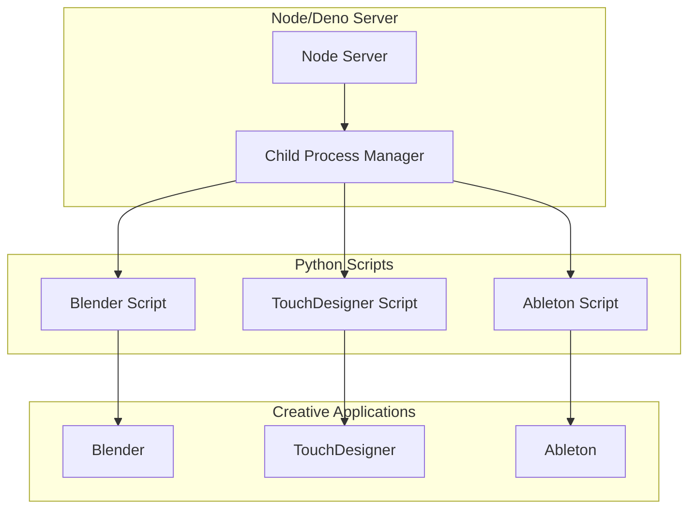

### 3. Simplified Client Library

The client library provides a simple interface for interacting with the creative applications:

```typescript
class BlenderClient {
  private ws: WebSocket;

  constructor(serverUrl: string) {
    this.ws = new WebSocket(serverUrl);
    this.setupWebSocket();
  }

  public async executePython(code: string): Promise<any> {
    // Send code to server, which forwards to Python script
    // Return result from Blender
  }
}
```

### Benefits of the Simplified Approach

1. **Reduced Complexity**: No need for complex bridge architecture
2. **Easier Development**: Python scripts can be developed and tested independently
3. **Faster Prototyping**: Quick iteration on application-specific functionality
4. **Simplified Maintenance**: Each component has a clear, focused responsibility
5. **Flexible Deployment**: Python scripts can be updated without changing the Node/Deno code

## Message Flow

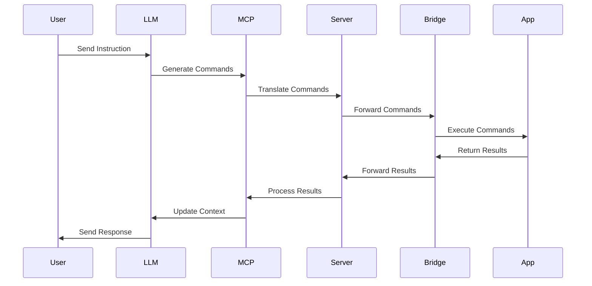

### Simplified Message Flow

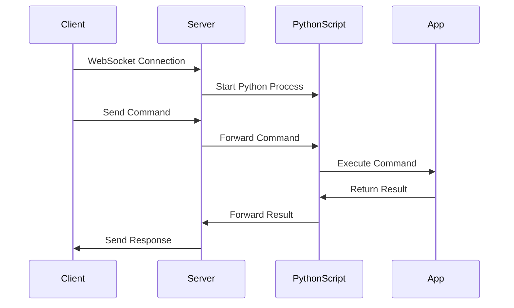

## State Management

The system maintains state for:
- Connection status
- Application capabilities
- Active operations
- Error states

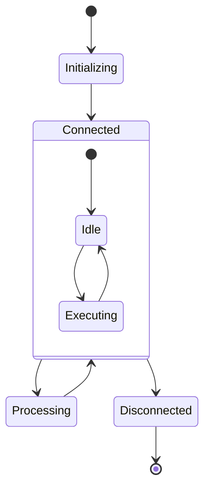

## Error Handling

The system implements a comprehensive error handling strategy:

1. Connection Errors
   - Automatic reconnection attempts
   - Exponential backoff
   - Maximum retry limits

2. Command Errors
   - Validation before execution
   - Timeout handling
   - Error reporting to clients

3. Application Errors
   - Graceful degradation
   - State recovery
   - Error logging

## Security Considerations

1. Authentication
   - WebSocket connection authentication
   - Command authorization
   - Application-specific credentials

2. Data Validation
   - Input sanitization
   - Type checking
   - Schema validation

3. Rate Limiting
   - Per-client limits
   - Per-command limits
   - Burst protection

## Performance Considerations

1. Message Queue
   - Priority queuing
   - Batch processing
   - Load balancing

2. Connection Management
   - Connection pooling
   - Keep-alive mechanisms
   - Resource cleanup

3. Caching
   - Response caching
   - State caching
   - Command result caching

## Monitoring and Logging

1. Metrics
   - Connection counts
   - Message rates
   - Error rates
   - Response times

2. Logging
   - Structured logging
   - Log levels
   - Log rotation

3. Alerts
   - Error thresholds
   - Performance degradation
   - Connection loss

## Extension Points

The architecture is designed to be extensible:

1. New Applications
   - Bridge interface
   - Client interface
   - Message types

2. New Features
   - Plugin system
   - Command handlers
   - State managers

3. New Protocols
   - Transport layer abstraction
   - Protocol adapters
   - Message translators

## Configuration

The system uses a comprehensive configuration system:

```typescript
interface SystemConfig {
  llm: {
    provider: 'claude' | 'openai';
    model: string;
    apiKey: string;
  };
  mcp: {
    servers: {
      [app: string]: {
        type: string;
        config: MCPConfig;
      };
    };
  };
  applications: {
    [app: string]: {
      bridge: string;
      capabilities: string[];
    };
  };
}
```

## MCP Architecture

### 1. MCP Components

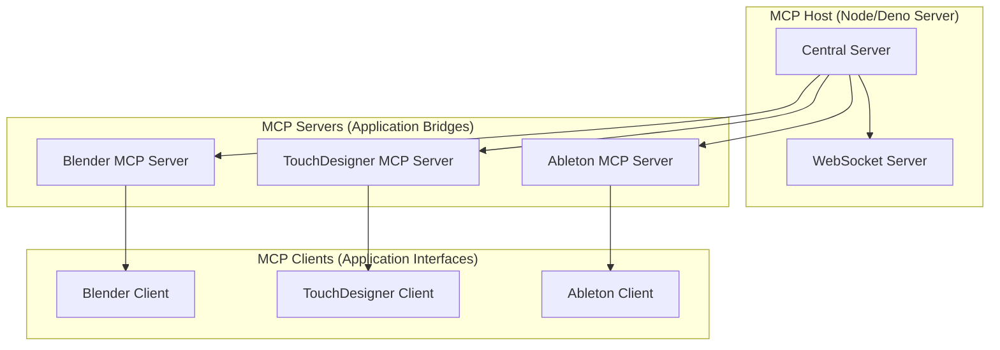

### 2. Component Roles

#### MCP Host
The MCP Host is the central coordinator of all MCP communications:

```typescript
interface MPCHost {
  // Server management
  startServer(): Promise<void>;
  stopServer(): Promise<void>;

  // Connection management
  registerServer(server: MCPServer): Promise<void>;
  unregisterServer(serverId: string): Promise<void>;

  // Message routing
  routeMessage(message: Message): Promise<void>;
  broadcastMessage(message: Message): Promise<void>;

  // State management
  getServerState(serverId: string): Promise<ServerState>;
  updateServerState(serverId: string, state: ServerState): Promise<void>;
}
```

#### MCP Servers
MCP Servers handle application-specific communication:

```typescript
interface MCPServer {
  // Server identification
  readonly id: string;
  readonly type: ApplicationType;

  // Command handling
  executeCommand(command: Command): Promise<Result>;
  validateCommand(command: Command): Promise<ValidationResult>;

  // State management
  getState(): Promise<ApplicationState>;
  updateState(state: Partial<ApplicationState>): Promise<void>;

  // Event handling
  onStateChange(callback: (state: ApplicationState) => void): void;
  onError(callback: (error: Error) => void): void;
}
```

#### MCP Clients
MCP Clients provide type-safe interfaces for application control:

```typescript
interface MCPClient {
  // Connection management
  connect(): Promise<void>;
  disconnect(): Promise<void>;

  // Command execution
  sendCommand(command: Command): Promise<Result>;
  sendBatchCommands(commands: Command[]): Promise<Result[]>;

  // State management
  getState(): Promise<ClientState>;
  subscribeToState(callback: (state: ClientState) => void): void;

  // Error handling
  onError(callback: (error: Error) => void): void;
  retryCommand(command: Command, maxRetries: number): Promise<Result>;
}
```

### 3. Communication Flow

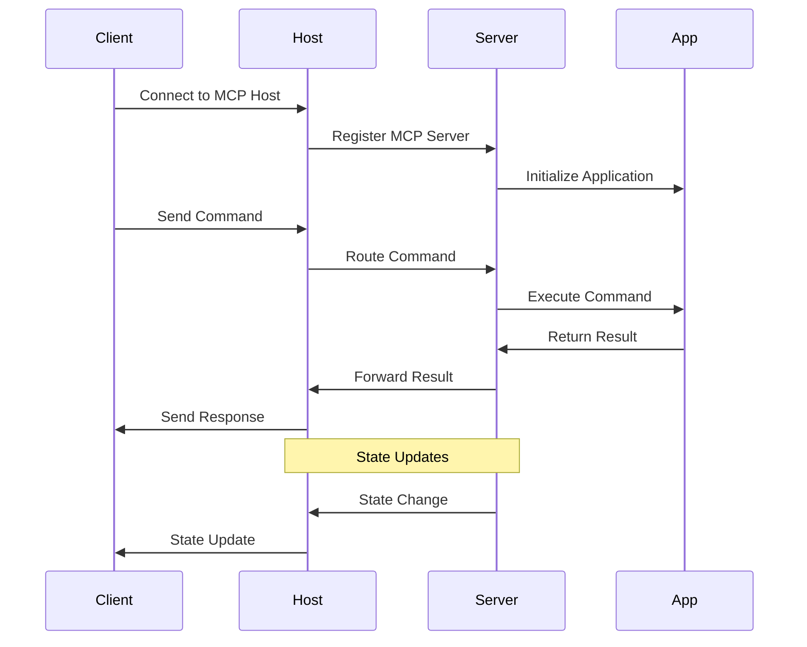

### 4. Protocol Messages

```typescript
interface MCPMessage {
  type: MessageType;
  payload: any;
  metadata: {
    timestamp: number;
    source: string;
    target: string;
    correlationId: string;
  };
}

enum MessageType {
  COMMAND = 'command',
  RESULT = 'result',
  STATE_UPDATE = 'state_update',
  ERROR = 'error',
  HEARTBEAT = 'heartbeat'
}
```

## Error Handling Strategies

### 1. Error Types and Hierarchy

```typescript
// Base error class for all application errors
class LightfastError extends Error {
  constructor(
    message: string,
    public code: string,
    public severity: ErrorSeverity,
    public context?: Record<string, unknown>
  ) {
    super(message);
    this.name = 'LightfastError';
  }
}

// IPC-specific errors
class IPCError extends LightfastError {
  constructor(message: string, context?: Record<string, unknown>) {
    super(message, 'IPC_ERROR', ErrorSeverity.CRITICAL, context);
    this.name = 'IPCError';
  }
}

// Process management errors
class ProcessError extends LightfastError {
  constructor(message: string, context?: Record<string, unknown>) {
    super(message, 'PROCESS_ERROR', ErrorSeverity.CRITICAL, context);
    this.name = 'ProcessError';
  }
}

// Application-specific errors
class ApplicationError extends LightfastError {
  constructor(
    message: string,
    public application: string,
    context?: Record<string, unknown>
  ) {
    super(message, 'APPLICATION_ERROR', ErrorSeverity.ERROR, context);
    this.name = 'ApplicationError';
  }
}

// Command execution errors
class CommandError extends LightfastError {
  constructor(
    message: string,
    public command: string,
    context?: Record<string, unknown>
  ) {
    super(message, 'COMMAND_ERROR', ErrorSeverity.ERROR, context);
    this.name = 'CommandError';
  }
}

enum ErrorSeverity {
  INFO = 'info',
  WARNING = 'warning',
  ERROR = 'error',
  CRITICAL = 'critical'
}
```

### 2. Error Handling Patterns

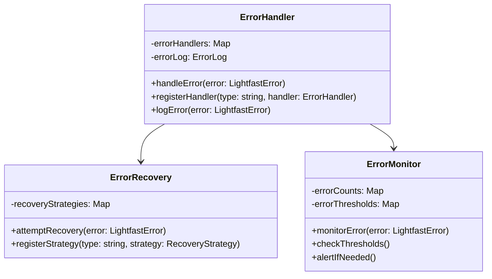

### 3. Error Recovery Strategies

```typescript
interface RecoveryStrategy {
  // Attempt to recover from an error
  attemptRecovery(error: LightfastError): Promise<boolean>;

  // Check if recovery is possible
  canRecover(error: LightfastError): boolean;

  // Get recovery status
  getStatus(): RecoveryStatus;
}

class ProcessRecoveryStrategy implements RecoveryStrategy {
  async attemptRecovery(error: ProcessError): Promise<boolean> {
    if (error.code === 'PROCESS_CRASHED') {
      // Attempt to restart the process
      return await this.restartProcess(error.context.processId);
    }
    return false;
  }

  canRecover(error: ProcessError): boolean {
    return error.code === 'PROCESS_CRASHED' ||
           error.code === 'PROCESS_TIMEOUT';
  }

  getStatus(): RecoveryStatus {
    return {
      attempts: this.attemptCount,
      lastAttempt: this.lastAttemptTime,
      success: this.lastAttemptSuccess
    };
  }
}
```

### 4. Error Monitoring and Alerting

```typescript
interface ErrorMonitor {
  // Track error occurrence
  trackError(error: LightfastError): void;

  // Check error thresholds
  checkThresholds(): boolean;

  // Get error statistics
  getStatistics(): ErrorStatistics;
}

class ErrorAlertSystem {
  private readonly thresholds = {
    [ErrorSeverity.CRITICAL]: 1,
    [ErrorSeverity.ERROR]: 5,
    [ErrorSeverity.WARNING]: 10
  };

  private errorCounts: Map<ErrorSeverity, number> = new Map();

  trackError(error: LightfastError): void {
    const count = this.errorCounts.get(error.severity) || 0;
    this.errorCounts.set(error.severity, count + 1);

    if (this.shouldAlert(error.severity)) {
      this.sendAlert(error);
    }
  }

  private shouldAlert(severity: ErrorSeverity): boolean {
    const count = this.errorCounts.get(severity) || 0;
    return count >= this.thresholds[severity];
  }
}
```

### 5. Error Handling Flow

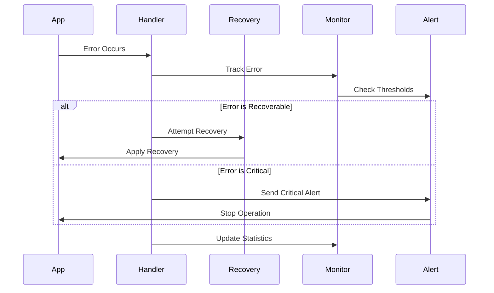

### 6. Implementation Example

```typescript
class IPCManager {
  private errorHandler: ErrorHandler;
  private errorMonitor: ErrorMonitor;
  private recoveryStrategies: Map<string, RecoveryStrategy>;

  constructor() {
    this.errorHandler = new ErrorHandler();
    this.errorMonitor = new ErrorMonitor();
    this.recoveryStrategies = new Map();

    // Register recovery strategies
    this.recoveryStrategies.set('PROCESS_ERROR', new ProcessRecoveryStrategy());
    this.recoveryStrategies.set('IPC_ERROR', new IPCRecoveryStrategy());
  }

  async handleError(error: LightfastError): Promise<void> {
    // Log error
    this.errorHandler.logError(error);

    // Track error
    this.errorMonitor.trackError(error);

    // Attempt recovery if possible
    const strategy = this.recoveryStrategies.get(error.code);
    if (strategy && strategy.canRecover(error)) {
      const recovered = await strategy.attemptRecovery(error);
      if (!recovered) {
        // If recovery failed, escalate
        this.errorHandler.handleError(error);
      }
    } else {
      // No recovery strategy, handle normally
      this.errorHandler.handleError(error);
    }
  }
}
```

### 7. Error Prevention Strategies

1. **Input Validation**:
```typescript
function validateCommand(command: Command): ValidationResult {
  if (!command.type || !command.payload) {
    throw new CommandError('Invalid command structure');
  }
  // Additional validation
}
```

2. **Timeout Handling**:
```typescript
async function executeWithTimeout<T>(
  operation: Promise<T>,
  timeout: number
): Promise<T> {
  const timeoutPromise = new Promise((_, reject) => {
    setTimeout(() => reject(new TimeoutError()), timeout);
  });

  return Promise.race([operation, timeoutPromise]);
}
```

3. **State Verification**:
```typescript
function verifyState(state: ApplicationState): void {
  if (!state.isValid()) {
    throw new StateError('Invalid application state');
  }
}
```
