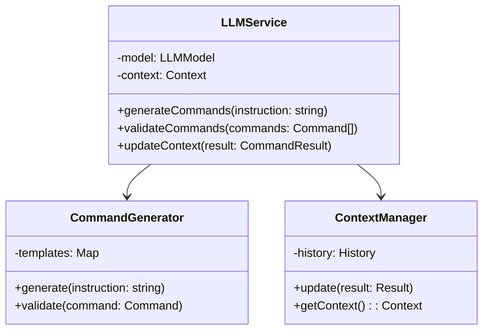
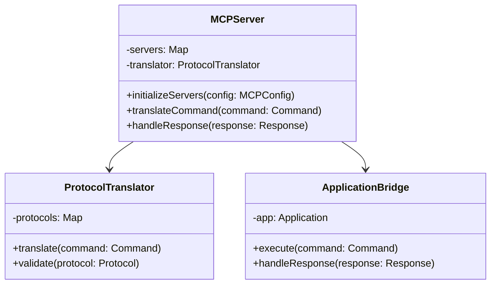
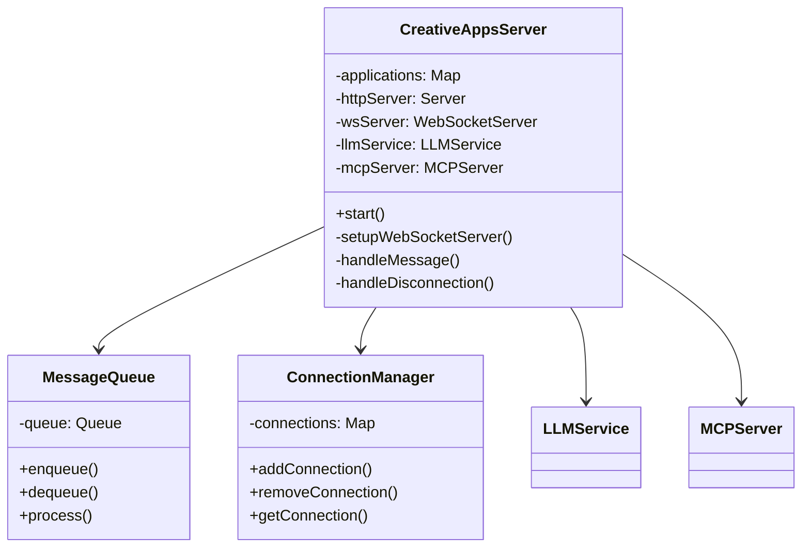
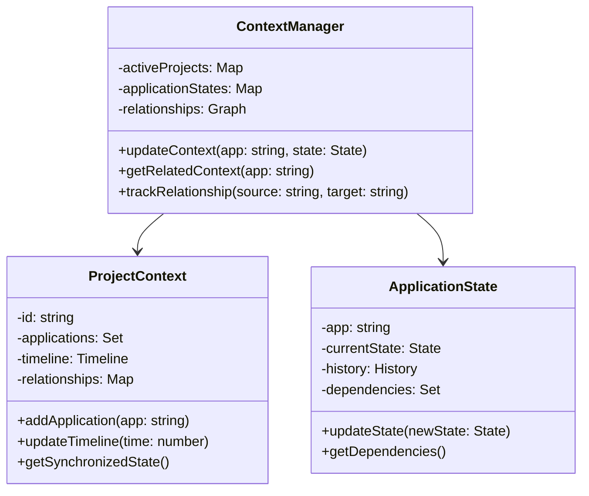
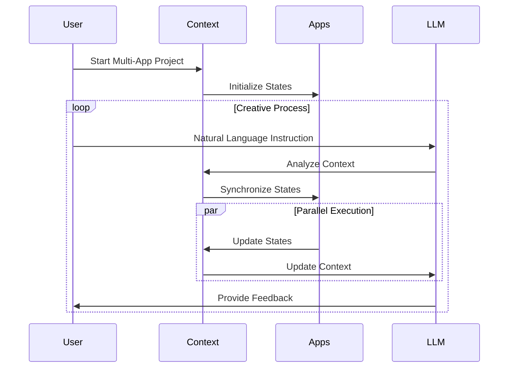
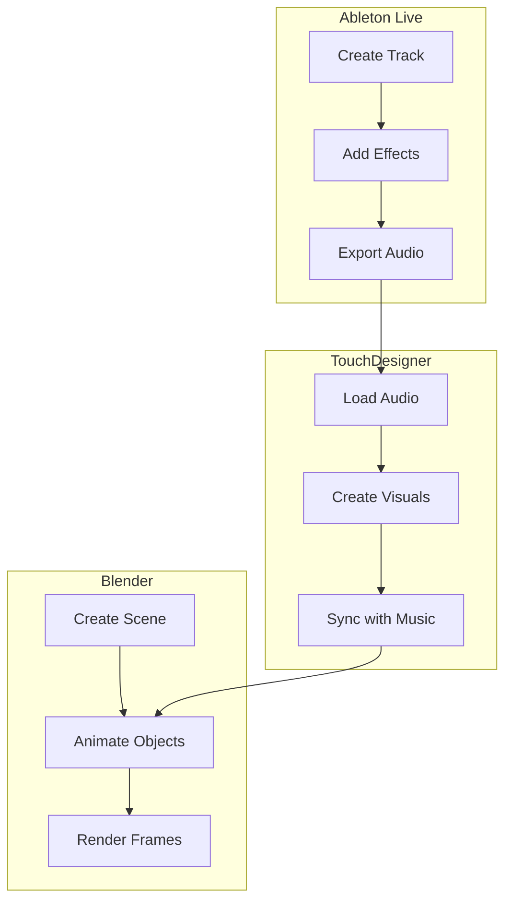
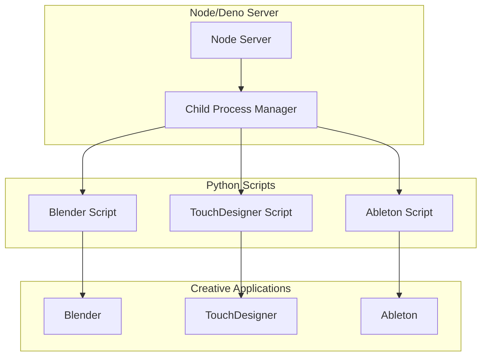
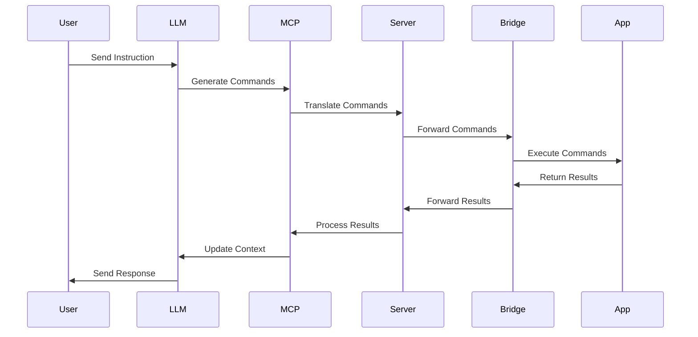
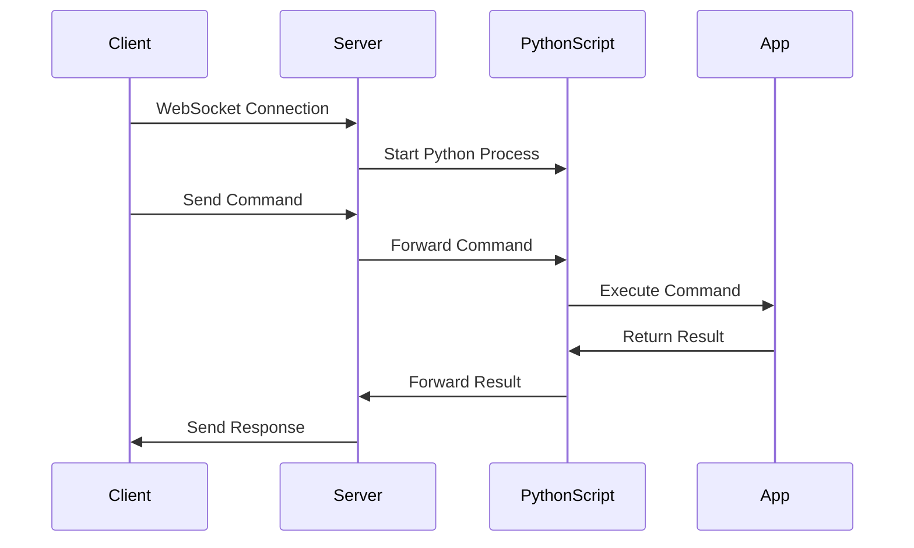
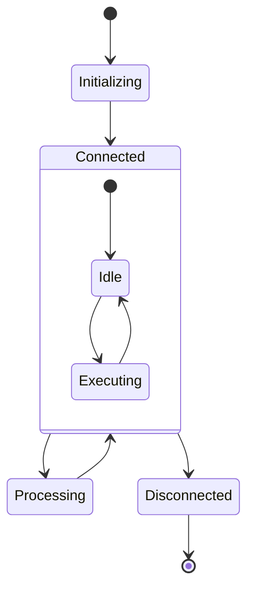

# Architecture Documentation

## System Overview

The Creative Apps IPC Server is designed as a centralized communication hub for creative applications. It uses a WebSocket-based architecture to enable real-time, bidirectional communication between applications, enhanced with LLM-powered instruction generation and MCP (Model Context Protocol) integration.

## Component Architecture

### 1. LLM Service Layer

The LLM service layer handles instruction generation and command validation:



### 2. MCP Integration Layer

The MCP layer manages communication between LLM and applications:



### 3. Central Server

The central server manages all communications:

- HTTP Server for REST API endpoints
- WebSocket Server for real-time communication
- Message Queue for handling asynchronous operations
- Connection Manager for tracking application states



### 4. Application Bridges

Bridges are application-specific components that handle the translation between the central server's protocol and each application's native API.

#### Blender Bridge
- Uses Python API
- Handles scene manipulation
- Manages object creation and modification
- Controls rendering settings

#### TouchDesigner Bridge
- Uses Python API
- Manages node creation and connections
- Controls parameter values
- Handles texture updates

#### Ableton Bridge
- Uses MIDI/OSC protocol
- Controls transport (play, stop, etc.)
- Manages clip launching
- Handles parameter automation

### 5. Clients

TypeScript clients provide type-safe interfaces for interacting with each application:

```typescript
interface BaseClient {
  connect(): Promise<void>;
  disconnect(): Promise<void>;
  send(message: Message): Promise<Response>;
}

interface BlenderClient extends BaseClient {
  executePython(code: string): Promise<void>;
  createObject(type: string, params: ObjectParams): Promise<void>;
  updateScene(data: SceneData): Promise<void>;
}
```

### 1. Context Management Layer

The context management layer handles state and relationships across multiple applications:



### 2. Cross-Application Synchronization



### 3. State Management

The system maintains several types of state:

1. **Project State**
   - Active applications
   - Timeline synchronization
   - Cross-application dependencies
   - Project metadata

2. **Application State**
   - Current operation mode
   - Active elements
   - Parameter values
   - Operation history

3. **Relationship State**
   - Data flow between applications
   - Synchronization points
   - Dependency chains
   - Event triggers

### 4. Context-Aware Instruction Generation

The LLM service uses context to generate appropriate commands:

```typescript
interface ContextAwareLLM {
  // Generate commands considering all active applications
  generateMultiAppCommands(
    instruction: string,
    context: ProjectContext
  ): Promise<Command[]>;

  // Validate commands against current state
  validateMultiAppCommands(
    commands: Command[],
    context: ProjectContext
  ): Promise<ValidationResult>;

  // Update context based on execution results
  updateProjectContext(
    results: CommandResult[],
    context: ProjectContext
  ): Promise<void>;
}
```

### 5. Example Workflow: Music-Visual Creation



## Alternative Simplified Architecture

For simpler implementations or prototyping, an alternative approach uses standalone Python scripts that are executed and managed by Node/Deno. This approach reduces complexity while maintaining the core functionality.

### 1. Standalone Python Scripts

Each creative application has a dedicated Python script that:
- Connects to the Node/Deno server via WebSocket
- Receives commands and executes them in the application
- Returns results back to the server

### 2. Node/Deno Process Manager

The Node/Deno server:
- Spawns and manages Python script processes
- Handles WebSocket communication with clients
- Forwards commands to the appropriate Python script
- Returns results to clients



### 3. Simplified Client Library

The client library provides a simple interface for interacting with the creative applications:

```typescript
class BlenderClient {
  private ws: WebSocket;

  constructor(serverUrl: string) {
    this.ws = new WebSocket(serverUrl);
    this.setupWebSocket();
  }

  public async executePython(code: string): Promise<any> {
    // Send code to server, which forwards to Python script
    // Return result from Blender
  }
}
```

### Benefits of the Simplified Approach

1. **Reduced Complexity**: No need for complex bridge architecture
2. **Easier Development**: Python scripts can be developed and tested independently
3. **Faster Prototyping**: Quick iteration on application-specific functionality
4. **Simplified Maintenance**: Each component has a clear, focused responsibility
5. **Flexible Deployment**: Python scripts can be updated without changing the Node/Deno code

## Message Flow



### Simplified Message Flow



## State Management

The system maintains state for:
- Connection status
- Application capabilities
- Active operations
- Error states



## Error Handling

The system implements a comprehensive error handling strategy:

1. Connection Errors
   - Automatic reconnection attempts
   - Exponential backoff
   - Maximum retry limits

2. Command Errors
   - Validation before execution
   - Timeout handling
   - Error reporting to clients

3. Application Errors
   - Graceful degradation
   - State recovery
   - Error logging

## Security Considerations

1. Authentication
   - WebSocket connection authentication
   - Command authorization
   - Application-specific credentials

2. Data Validation
   - Input sanitization
   - Type checking
   - Schema validation

3. Rate Limiting
   - Per-client limits
   - Per-command limits
   - Burst protection

## Performance Considerations

1. Message Queue
   - Priority queuing
   - Batch processing
   - Load balancing

2. Connection Management
   - Connection pooling
   - Keep-alive mechanisms
   - Resource cleanup

3. Caching
   - Response caching
   - State caching
   - Command result caching

## Monitoring and Logging

1. Metrics
   - Connection counts
   - Message rates
   - Error rates
   - Response times

2. Logging
   - Structured logging
   - Log levels
   - Log rotation

3. Alerts
   - Error thresholds
   - Performance degradation
   - Connection loss

## Extension Points

The architecture is designed to be extensible:

1. New Applications
   - Bridge interface
   - Client interface
   - Message types

2. New Features
   - Plugin system
   - Command handlers
   - State managers

3. New Protocols
   - Transport layer abstraction
   - Protocol adapters
   - Message translators

## Configuration

The system uses a comprehensive configuration system:

```typescript
interface SystemConfig {
  llm: {
    provider: 'claude' | 'openai';
    model: string;
    apiKey: string;
  };
  mcp: {
    servers: {
      [app: string]: {
        type: string;
        config: MCPConfig;
      };
    };
  };
  applications: {
    [app: string]: {
      bridge: string;
      capabilities: string[];
    };
  };
}
```
