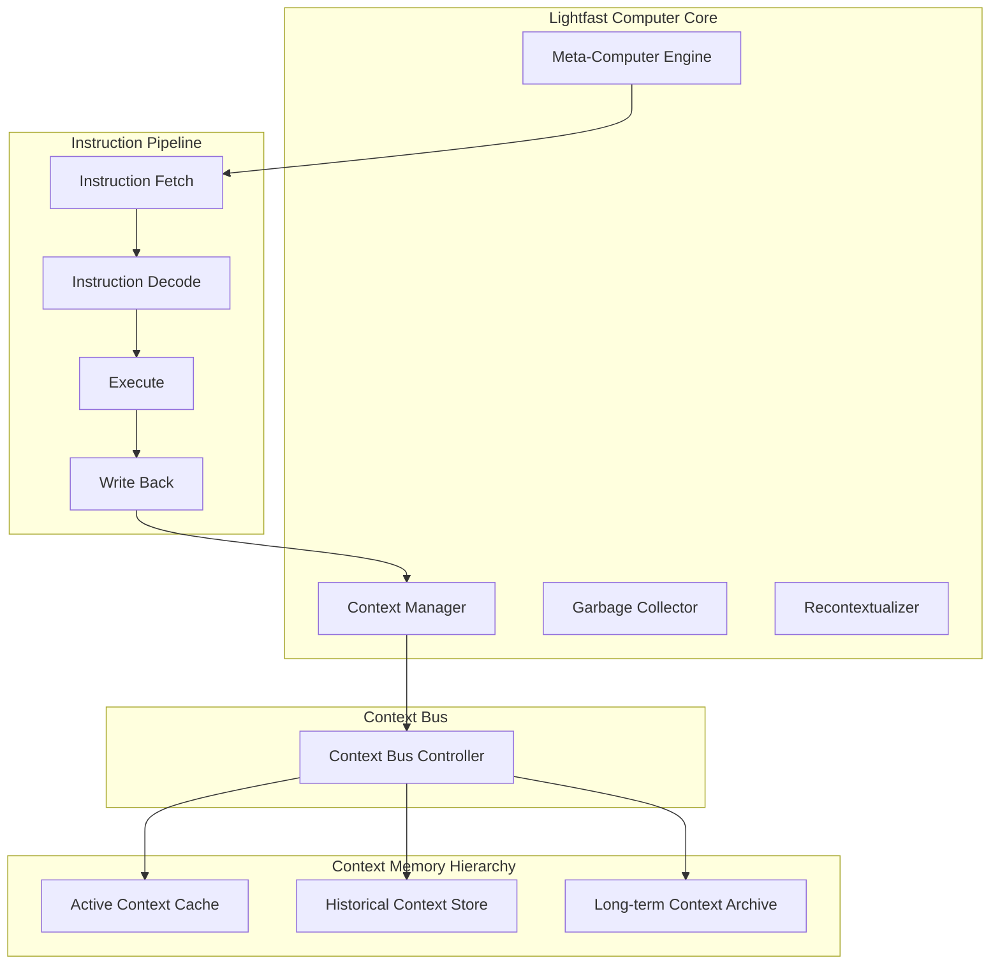
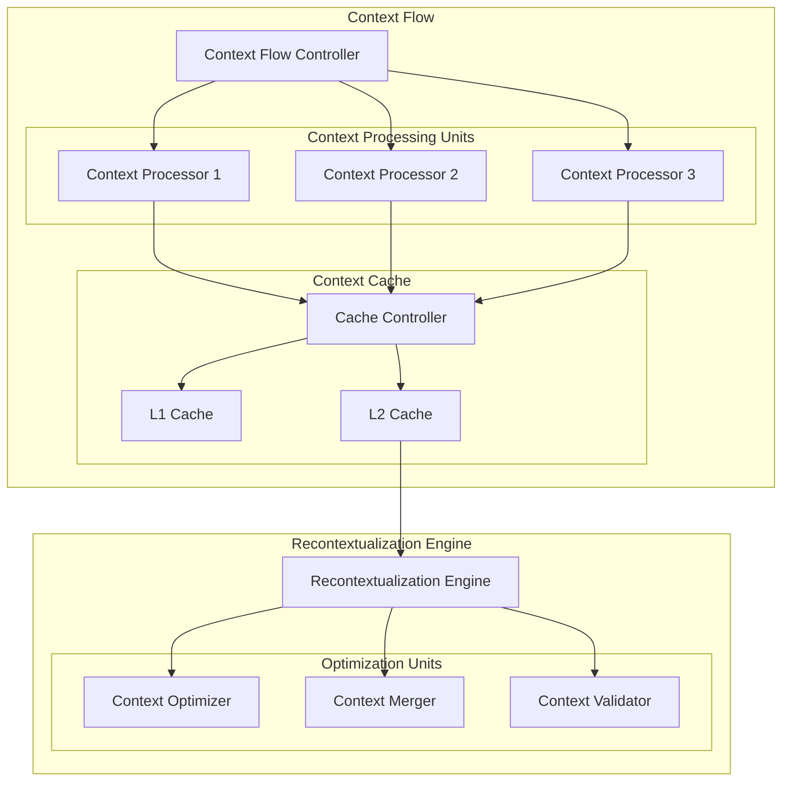
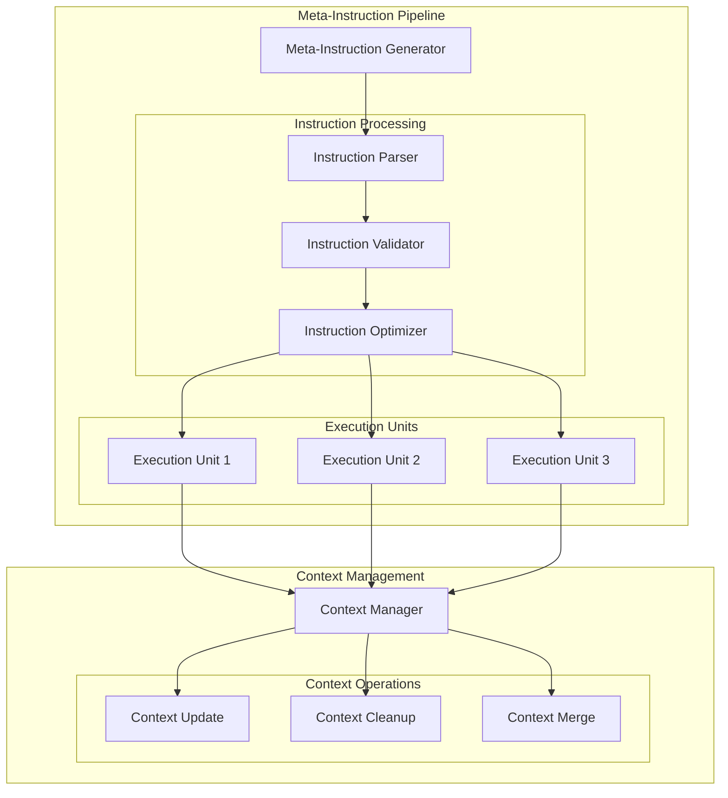
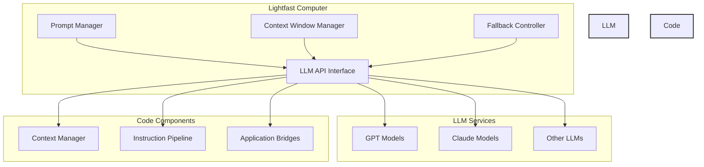
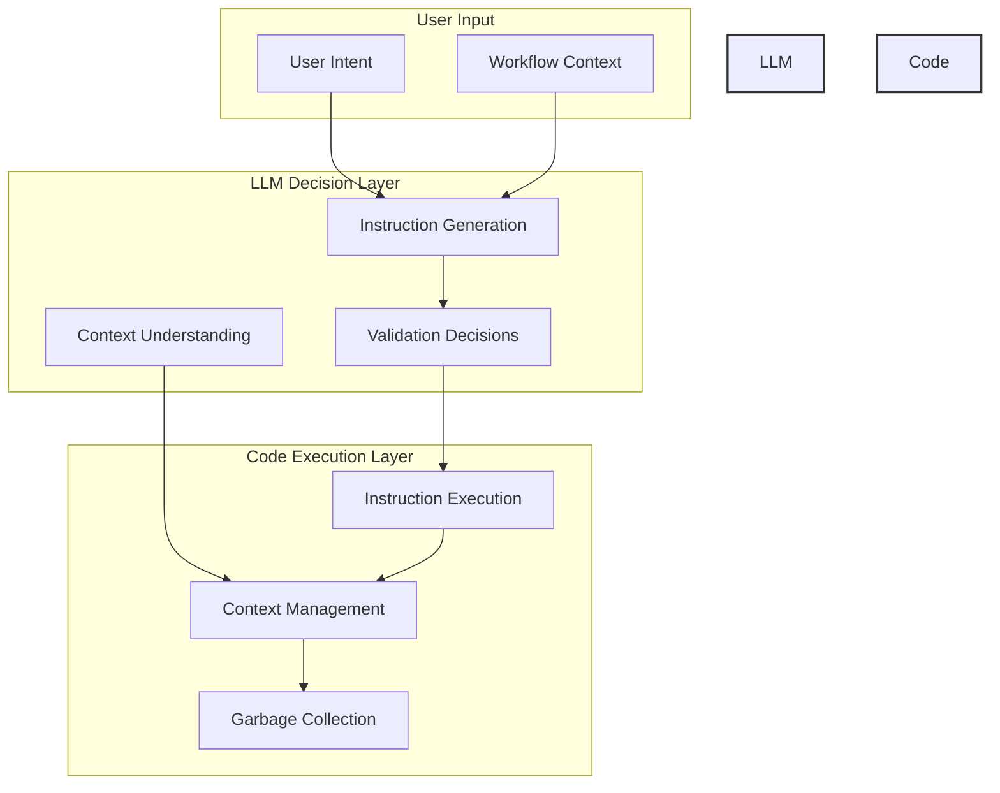
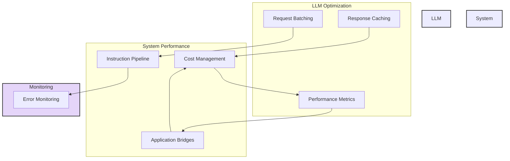

# Lightfast Computer Architecture

## Abstract

This document presents the architectural design of the Lightfast Computer, a meta-computation system designed for orchestrating AI-powered creative workflows. The architecture introduces novel concepts in context management, instruction generation, and workflow orchestration, positioning itself as a higher-order system for coordinating multiple AI generation services and creative applications.

## 1. Introduction

The Lightfast Computer represents a paradigm shift in how we approach AI-assisted creative workflows. Unlike traditional systems that directly interface with AI services, the Lightfast Computer acts as a meta-computation layer that maintains context awareness and orchestrates complex workflows across multiple AI generation services and creative applications.

## 2. System Overview

### 2.1 Core Components

### 2.2 Key Architectural Features

1. **Meta-Computer Core**
   - Central processing unit for meta-computation
   - Instruction generation and execution
   - Context operation coordination

2. **Context Memory Hierarchy**
   - L1: Active Context Cache (fastest, most frequently accessed)
   - L2: Historical Context Store (medium-term storage)
   - L3: Long-term Context Archive (persistent storage)

3. **Instruction Pipeline**
   - Instruction Fetch: Retrieves next instruction
   - Instruction Decode: Interprets instruction type and parameters
   - Execute: Performs the instruction operation
   - Write Back: Updates context and state

4. **Context Bus**
   - Manages data flow between components
   - Handles context synchronization
   - Coordinates memory access

## 3. Context Management System

### 3.1 Context Flow Architecture

### 3.2 Context Processing

1. **Context Flow Controller**
   - Manages context distribution
   - Handles context prioritization
   - Controls context flow between processors

2. **Context Processing Units**
   - Parallel processing of context operations
   - Specialized units for different context types
   - Optimized for specific context operations

3. **Context Cache System**
   - Multi-level cache hierarchy
   - Cache coherence management
   - Context prefetching

4. **Recontextualization Engine**
   - Context optimization
   - Context merging
   - Context validation

## 4. Meta-Instruction Pipeline

### 4.1 Pipeline Architecture

### 4.2 Pipeline Features

1. **Parallel Processing**
   - Multiple context processors
   - Parallel instruction execution
   - Concurrent context operations

2. **Memory Hierarchy**
   - Multi-level context storage
   - Cache optimization
   - Context prefetching

3. **Pipeline Efficiency**
   - Instruction pipelining
   - Context flow optimization
   - Parallel execution units

4. **Context Management**
   - Sophisticated context operations
   - Context optimization
   - Context validation

## 5. System Integration

### 5.1 AI Service Integration

The Lightfast Computer interfaces with various AI generation services:

1. **Language Models**
   - Text generation
   - Instruction interpretation
   - Context understanding

2. **Image Generators**
   - Visual content creation
   - Style transfer
   - Image manipulation

3. **Video Generators**
   - Motion synthesis
   - Temporal consistency
   - Video editing

4. **Audio Generators**
   - Sound synthesis
   - Audio processing
   - Music generation

### 5.2 Creative Application Integration

Integration with creative applications through:

1. **Application Bridges**
   - Protocol translation
   - Command execution
   - State synchronization

2. **Context Sharing**
   - Cross-application context
   - State management
   - Workflow coordination

## 6. LLM vs. Pure Code Implementation

### 6.1 Component Distribution

```mermaid
graph TB
    subgraph "LLM Components"
        direction TB
        MIG[Meta-Instruction Generator]
        CU[Context Understanding]
        REL[Recontextualization Logic]
        IV[Instruction Validator]
    end

    subgraph "Pure Code Components"
        direction TB
        CMM[Context Memory Management]
        IPE[Instruction Pipeline Execution]
        GC[Garbage Collection]
        CS[Context Cache System]
        AB[Application Bridges]
    end

    subgraph "Hybrid Components"
        direction TB
        CFC[Context Flow Controller]
        CPU[Context Processing Units]
        IPO[Instruction Parser/Optimizer]
    end

    style LLM Components fill:#f9d5e5,stroke:#333,stroke-width:2px
    style Pure Code Components fill:#d5f9e5,stroke:#333,stroke-width:2px
    style Hybrid Components fill:#e5d5f9,stroke:#333,stroke-width:2px
```

### 6.2 LLM Integration Architecture

### 6.3 Decision Flow Architecture

### 6.4 Performance Optimization Architecture

## 7. Future Work

1. **Scalability Improvements**
   - Distributed context management
   - Load balancing
   - Resource optimization

2. **Context Optimization**
   - Advanced garbage collection
   - Context compression
   - Memory efficiency

3. **Integration Expansion**
   - New AI service types
   - Additional creative applications
   - Enhanced protocol support

## 8. Conclusion

The Lightfast Computer architecture represents a significant advancement in meta-computation systems, providing a robust foundation for AI-powered creative workflows. Its sophisticated context management and instruction pipeline enable efficient coordination of multiple AI services and creative applications.
